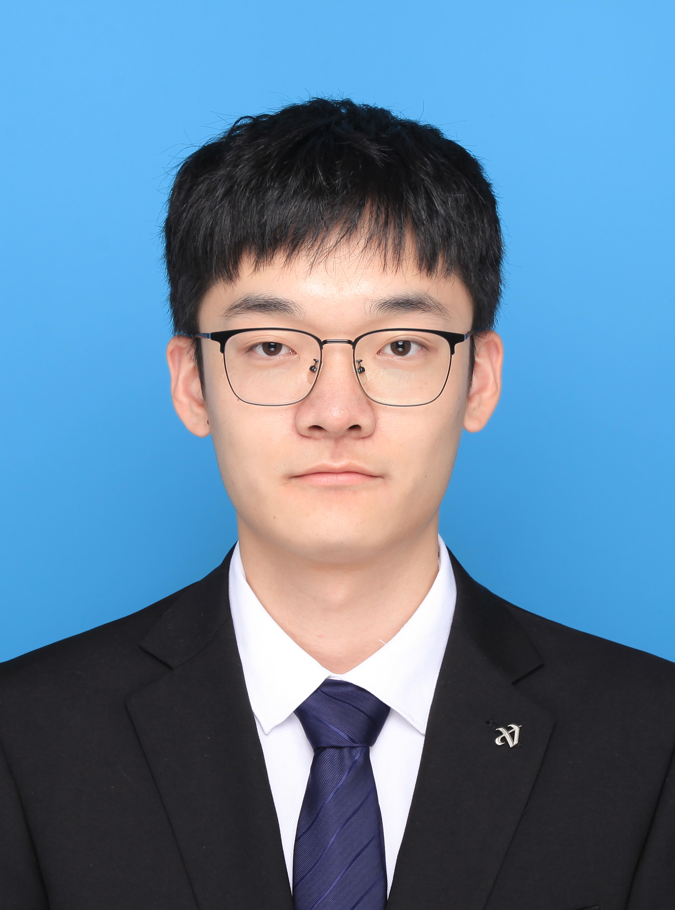

<!-- Profile Section with Photo -->
<table width="100%">
  <tr>
    <td width="180" valign="top">
      
    </td>
    <td valign="top">
      <h1>刘非凡 (Liu Feifan)</h1>
      <h3>本科3年级</h3>
      

        <strong>研学方向</strong>: <strong>边缘计算智能系统、编译器优化、 &nbsp;&nbsp;&nbsp;&nbsp;&nbsp;&nbsp;&nbsp;&nbsp;&nbsp;&nbsp;&nbsp;&nbsp;&nbsp;&nbsp;&nbsp;&nbsp;&nbsp;&nbsp;大模型强化学习、多模态传感器融合</strong>
          
        <strong>联系方式</strong>: 166 2756 0886 (微信同)
         
        <strong>电子邮箱</strong>: feifan-liu@henu.edu.cn
      

    </td>
  </tr>
</table>

---

## 🎓 教育背景 (Education)
- **河南大学** (**"双一流"高校**) | 自动化 | 2022.09 - 至今
- **专业排名**: **1/60名 (有推免资格)**
- **英语成绩**: CET4 513分 | CET6 436分
- **核心课程**: 电机与拖动 (99) | 电路原理 (98) | 嵌入式系统开发 (98) | 信号与系统 (97) | 单片机原理 (96) | 现代控制理论 (95) | 电力电子 (90)

---

## 🛠️ 专业技能 (Skills)
- **方案设计**: 软硬件嵌入式方案综合设计。
- **硬件开发**: 绘制4层PCB，熟悉SMT，能手焊BGA。
- **软件开发**: 深度学习、嵌入式、前端、GUI开发。
- **LLM协作**: 熟悉AI IDE编程，搭建LLM工作流。

---

## 🏆 荣誉奖项 (Honors & Awards)

- 获评 **[河南大学2025年"创新之星"](https://job.henu.edu.cn/module/newsdetail/id-141722/)** (**全校仅20人/5万余人**)。
- 入学至今，累计获得校级三好学生、校级奖学金、优秀学生干部等荣誉9项。

### 主要竞赛获奖
| 赛事名称 | 奖项 | 排名 | 简介 |
| :--- | :--- | :--- | :--- |
| **[2023嵌入式设计大赛](https://www.stmcu.com.cn/mkt_info/2785)** | **企业杯 \| 国一** | 1/3 | 无人机故障监测系统，端侧AI部署，作品获**5000余队中第一名** |
| **2024挑战杯课外学术作品竞赛** | **国赛银奖** | 1/10 | 解决大型石化厂区无源定位难题（企业发榜） |
| 2024 iCAN大学生创新创业大赛 | 国赛三等奖 | 3/5 | |
| 2024 数字媒体科技作品竞赛 | 国赛三等奖 | 2/5 | |
| 2024 中国国际大学生创新大赛 | 省赛金奖 | 6/15 | |
| 2023 互联网+创新创业大赛 | 省赛金奖 | 9/9 | |
| 2023 睿抗机器人大赛 | 省赛一等奖 | 2/3 | |
| 2024 华为ICT大赛 | 省赛一等奖 | 1/1 | |

---

## 🔬 科研经历 (Research Experience)

### Edge-Deployed Band-Split RoPE Transformer for Ultra-Low-Signal-to-Noise-Ratio UAV Speech Enhancement
*一作 | **已发表于《Drones》期刊 (JCR Q1, IF=4.8)** | 2025.01 - 2025.04*
- **(S) 情境**: 源于横向项目，需在无人机上安装麦克风实现收音，但螺旋桨噪音极大。
- **(T) 任务**: 设计轻量化AI模型进行语音增强（降噪），并实现端侧实时处理。
- **(A) 行动**: 借鉴音源分离领域的BS-RoFormer模型，利用其时频特征提取能力，设计了新的轻量化模型。
- **(R) 结果**: 相比现有方法，SI-SDR提升2.2dB，边缘部署内存占用<500MB，实时因子RTF为0.33。

### RACE-Align: Retrieval-Augmented and Chain-of-Thought Enhanced Preference Alignment for Large Language Models
*通讯作者 | **预印本 (arXiv)** | 2025.05 - 至今*
- **(S) 情境**: 大语言模型在垂直领域应用时，面临知识准确性、专业推理及可解释性不足的挑战。
- **(T) 任务**: 提出RACE-Align框架，构建含外部知识与思维链的偏好数据，使用DPO算法对齐模型。
- **(A) 行动**: 创新性地融合AI检索与思维链优化，通过AI驱动流程高效生成高质量偏好数据对。
- **(R) 结果**: 在Qwen3-1.7B模型上应用此框架训练后，大幅提升了知识性和领域推理能力，降低了幻觉率。

### A Compiler Optimization Engine Based on LLMs and RL
*一作 | **完成初稿 (意向期刊: 《Empirical Software Engineering》)** | 2024.10 - 至今*
- **(ST) 问题**: LLVM编译器通用Pass序列无法对特定代码达到最优优化，且Pass序列搜索消耗大量算力时间。
- **(AR) 方案**: 基于DeepSeek R1搭建编译优化框架，通过强化学习训练14B模型，相较于LLVM-Oz序列性能最高提升1.483倍。

### 国际级大创：基于AI-MEMS融合定位算法的高精度导航无人机
*负责人 | **优秀结项** | 2024.06 - 2025.04*
- **(ST) 问题**: 无人机依赖GPS，在室内等信号不良场景下无法定位，需设计基于MEMS的AI模式识别定位方案。
- **(AR) 方案**: 在嵌入式端部署AI模型，检测磁异常和零速状态，相关技术获"挑战杯"国赛银奖。

---

## 💻 项目与实践经历 (Projects & Practical Experience)

### 横向 | 上海柠檬科技有限公司 - 语音识别大模型的端侧部署
*2025.01 - 至今*
- **(ST) 背景**: Offer来自GitHub。随着ASR技术发展，开发低成本的端侧ASR嵌入式终端成为趋势。
- **(AR) 方案**: 主要负责整体方案设计与嵌入式AI模型部署工作，项目正在研发中。

### 横向 | 郑州芯视道机器人技术有限公司 - 管道机器人PCB设计
*硬件工程师 | 2024.01 - 2024.04*
- **(ST) 背景**: 校企合作项目，为管道检修机器人设计硬件。
- **(AR) 方案**: 负责设计巡检机器人的PCB电路板，包括Linux主控、20A大功率DC-DC、RJ45通信电路等。

### 横向 | 河南博锐流体设备有限公司 - 嵌入式方案、重点项目
*2024.09 - 2024.12*
- **(ST) 背景**: 课题组校企合作，该公司原有的管道信息传输系统基于有线架构，智能化程度低。
- **(AR) 方案**: 为其井下传感器设计了LoRa MESH无线通信方案以优化数据收集，并协助公司申请了省级重点项目。

---

## 🌐 媒体与开源贡献 (Social Media & Open Source)

- **B站视频** "[教你在ESP32上实现TFLM模型部署](https://www.bilibili.com/video/BV1uX8veJEGi)" 获 **2.5万+** 播放，相关项目仓库获 **55 Star** 与 **18 Fork**。

| 平台 | 主页链接 | 核心数据 | 二维码 (QR Code) |
| :--- | :--- | :--- | :--- |
| **哔哩哔哩** | [space.bilibili.com/1150690166](https://space.bilibili.com/1150690166) | 粉丝 **1k+** \| 播放量 **5w+** |  |
| **CSDN** | [blog.csdn.net/qq_38961840](https://blog.csdn.net/qq_38961840) | 阅读量 **9w+** \| 粉丝 **1w+** |  |
| **GitHub** | [github.com/LFF8888](https://github.com/LFF8888) | **71 Star** \| **18 Fork** |  |
| **立创开源** | [oshwhub.com/ff-studio/works](https://oshwhub.com/ff-studio/works) | **140 Star** \| **75 Like** |  |

